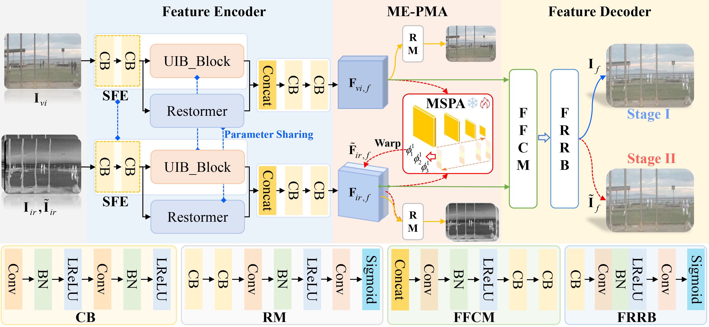
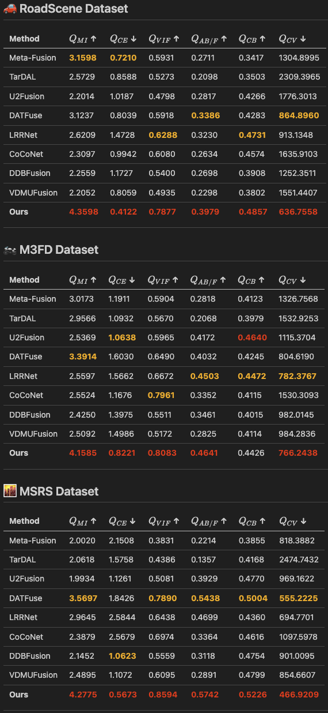
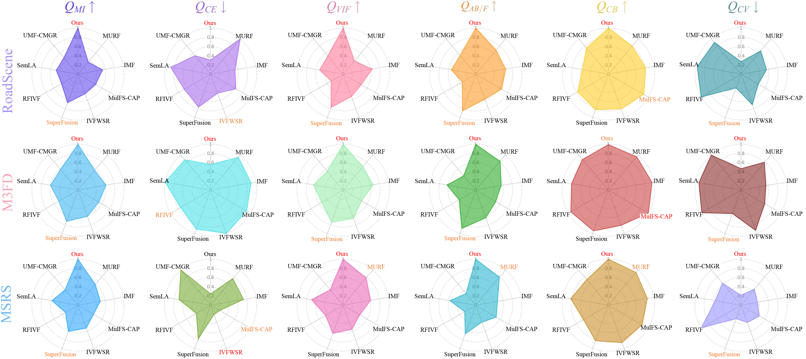
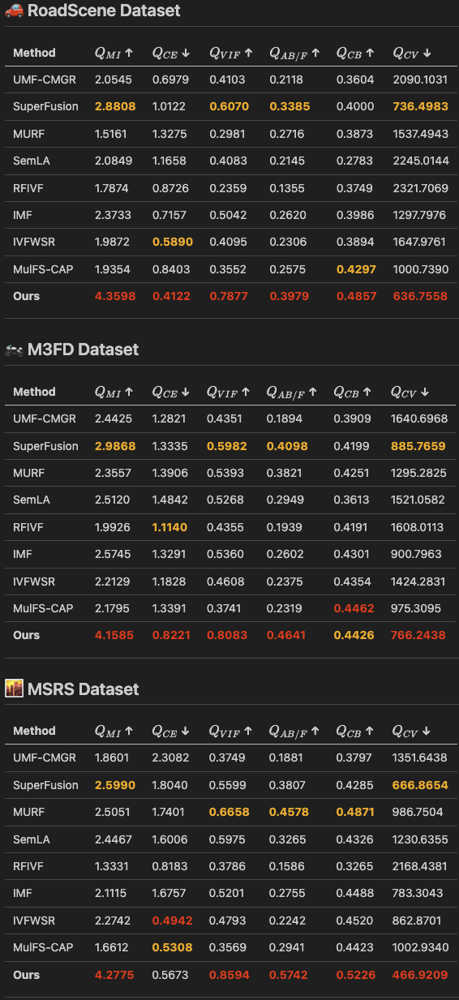
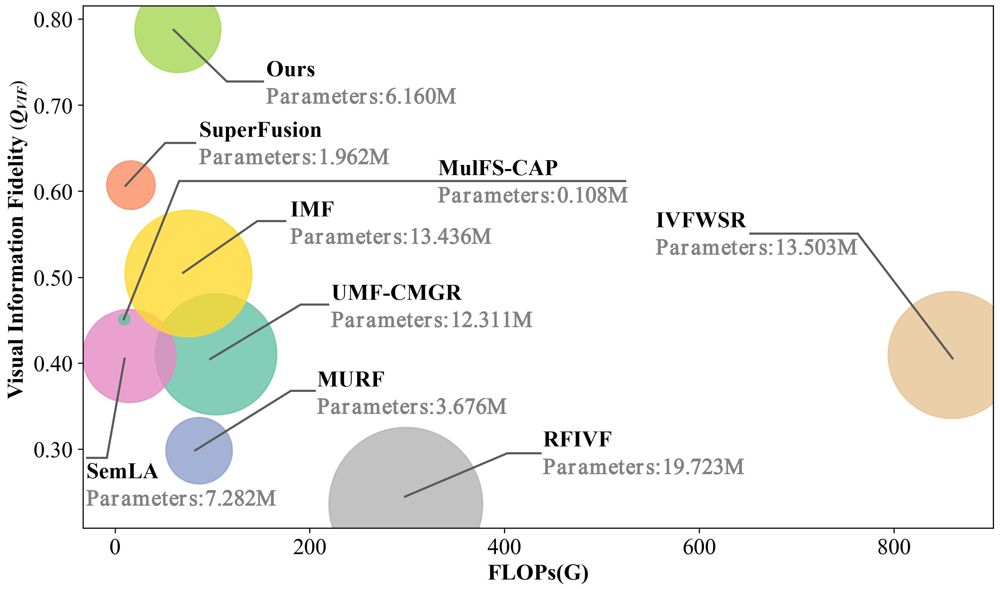

<div align="center">

# **联合多视角嵌入与渐进式多尺度对齐用于未配准的红外与可见图像融合**

<br>

[](https://doi.org/10.1016/j.inffus.2025.103960)  
[%20103960-orange?style=for-the-badge&logo=Elsevier&logoColor=white)](https://doi.org/10.1016/j.inffus.2025.103960)  
[](https://doi.org/10.1016/j.inffus.2025.103960)  
[](https://github.com/yidamyth/ME-PMA)

<br>

## 👨‍💻 **作者**

| 姓名                  | ORCID |
|---------------------|--------|
| **陈怡达 (a)**         | [](https://orcid.org/0009-0009-8320-4669) |
| **张亚飞 (a)**         | [](https://orcid.org/0000-0003-2347-5642) |
| **李华锋 (a, ✉ 通讯作者)** | [](https://orcid.org/0000-0003-2462-6174) |
| **余正涛 (a)**         | [](https://orcid.org/0000-0003-1094-5668) |
| **刘羽 (b)**          | [](https://orcid.org/0000-0003-2211-3535) |

<br>

🏫 **作者单位**

**a** 中国云南省昆明市 650500，昆明理工大学信息工程与自动化学院  
**b** 中国安徽省合肥市 230009，合肥工业大学生物医学工程系  

<br>

</div>

<div align="center">

[](https://ubuntu.com/)


</div>

<div style="background-color: #fff8c5; color: #000000; padding: 10px; border-left: 4px solid #f0ad4e; border-radius: 4px;">
<strong> 我们的论文已被《Information Fusion》(2026) 接收发表。在此，我们对审稿人、编辑和合作者的建设性反馈和持续支持表示衷心感谢。 </strong>
</div>

<br>

<div align="center">
<h3>
  <a href="./README.md">README-英文版</a> |
  <a href="./README_CN.md">README-中文版</a> 
</h3>
</div>

## 1. 引言

我们提出了一种端到端的红外-可见图像融合网络（ME-PMA），在特征层面实现图像配准，其主要特性包括：

- 针对未对齐场景，实现端到端的图像配准与融合
- 采用多视图嵌入的渐进式多尺度特征对齐
- 单一模型权重在多个数据集上都表现出卓越性能

### 网络架构



关键组件：

- **特征编码器**：SFE、UIB_Block 和 Restormer
- **MSPA**：多尺度渐进式对齐模块
- **特征解码器**：FFCM 融合和 FRRB 重建

### MSPA 模块


- Restormer_Corr：具有局部相关性的全局特征提取
- UIB_CA：用于局部特征的通道注意力
- Reg_flow：多视图配准光流预测

## 2. 环境配置

### 基础配置

```bash
git clone https://github.com/yidamyth/ME-PMA.git
cd ME-PMA

# 创建 conda 虚拟环境
conda create -n ME-PMA python=3.9.18
conda activate ME-PMA

# 安装 PyTorch
pip install torch==1.12.1+cu113
pip install torchvision==0.13.1+cu113

# 安装依赖
pip install -r requirements.txt
```

## 3. 数据准备

```text
.
└── ./DataSet/IVIF/
    ├── M3FD
        ├── test
            ├── ir
            ├── ir_move
            └── vis
    ├── MSRS
        ├── test
            ├── ir
            ├── ir_move
            └── vis
    └── RoadScene
        ├── RoadS_test
        │   ├── ir
        │   ├── ir_move
        │   └── vis
        └── RoadS_train
            ├── ir
            └── vis
```

## 4. 测试

端到端的特征层面配准与融合结果（输入图像来自未对齐场景）

```bash
python test_phase2.py
# 保存至: ./DataSet/IVIF/RoadScene/RoadS_test/Results/UnAligned/
```

直接融合结果（未使用配准模块，输入图像来自已对齐场景）

```bash
python test.py
# 保存至: ./DataSet/IVIF/RoadScene/RoadS_test/Results/Aligned/
```

> 您可以切换数据集以获取不同数据集的结果。默认测试路径为 `test_path['RoadScene']` 或 `['M3FD']` 或 `['MSRS']`；所有不同数据集的测试均使用相同的模型权重。

## 5. 训练

### 第一阶段训练（融合网络）

```bash
# 1. 查找 Python 路径
which python
# 输出: /home/yida/anaconda3/envs/ME-PMA/bin/python

# 2. 编辑 conda 路径
vim run.sh

# 3. 切换至你的 anaconda3 conda 路径
eval "$(/home/your_user_name_xxx/anaconda3/bin/conda shell.bash hook)"

# 4. 保存并退出 vim

# 5. 运行
sh ./run.sh

# 6. 检查日志
tail -f ./Logs/nohup/2024-1119-1001_time.log

# 7. 在后台运行程序后可退出终端
# 模型保存路径: ./Model/Parameters/24-1119-1001/

# 8. 退出程序
control + z
```

### 第二阶段训练（配准网络）

```bash
# 1. 编辑 conda 路径
vim run_phase2.sh
eval "$(/home/your_user_name_xxx/anaconda3/bin/conda shell.bash hook)"

# 加载第一阶段模型路径
phase2_model_id='24-1119-1001'
phase2_ModelPath='./Model/Parameters/24-1119-1001/RegImageFusModel-best.pth'
# 保存并退出 vim

# 2. 运行
sh ./run_phase2.sh

# 3. 检查日志
tail -f ./Logs/nohup/2024-1119-1355_time.log

# 4. 退出程序
control + z
```

## 6. 实验结果

### 配准 + 融合 对比可视化


### 联合优化对比可视化


### 评估指标

### 融合评估指标

- $Q_{CE↓}$
- $Q_{MI↑}$
- $Q_{VIF↑}$
- $Q_{AB/F↑}$
- $Q_{CB↑}$
- $Q_{CV↓}$

您可以通过以下示例获取我们的详细定量评估指标：

```python
python ./Util/metrics_fus.py
```

### 配准评估指标

- $Q_{MI↑}$
- $Q_{MS-SSIM↑}$
- $Q_{NCC↑}$

您可以通过以下示例获取我们的详细定量评估指标：

```python
python ./Util/metrics_reg.py
```

> 为方便起见，我们提供的指标脚本可以让您直接复现论文中报告的结果。  
>   
> 我们提供了完整的融合结果，以便进行直接且无偏差的指标评估。同时，我们也提供了调整尺寸后的输入图像，以帮助复现结果。虽然整体输出保持一致，但由于调整尺寸操作，可能会出现像素级的细微差异。  
>   
> 请注意，配准评估指标是三个数据集的平均值。

### 实验结果可视化

### 配准 + 融合 优化结果


### 📊 表1：配准 + 融合方法的定量对比 —— 详细结果

*(红色粗体=最佳，橙色粗体=第二佳)*

<p align="center">
  
</p>

📌 *注意：每列中，**红色粗体** 表示最佳，**橙色粗体** 表示第二佳。*

### 联合优化结果



### 📊 表2：联合优化方法的定量对比 —— 详细结果

*(红色粗体=最佳，橙色粗体=第二佳)*

<p align="center">
  
</p>

📌 *注意：每列中，**红色粗体** 表示最佳，**橙色粗体** 表示第二佳。*

### 仅配准性能对比结果


### 参数分析：联合优化



### 目标检测和语义分割

相关模型将很快更新并上传。

### 模型：参数量 + 计算量

```python
cd ./ME-PMA
python -m Model.Architecture.RegImageFusModel
```

## 🥰 致谢

本项目的整体架构由作者 @Yida Chen 独立设计。然而，部分实现参考了以下优秀的开源作品：

### 代码参考

- **CDDFuse：相关驱动的双分支特征分解用于多模态图像融合**  
  - (CVPR 2023) https://github.com/haozixiang1228/MMIF-CDDFuse

- **相关感知的粗到细 MLP 用于可变形医学图像配准**  
  - (CVPR 2024) https://github.com/MungoMeng/Registration-CorrMLP

- **MobileNetv4 实现**  
  - MobileNetv4-1：<https://github.com/jiaowoguanren0615/MobileNetV4>  
  - MobileNetv4-2：<https://github.com/jaiwei98/MobileNetV4-pytorch>

### 指标实现

- **可见光与红外图像融合的客观质量评估指标分析**  
  - (《中国图象图形学报》 2023) <https://github.com/sunbinuestc/VIF-metrics-analysis>

### 实验可视化工具

- **MulimgViewer**（用于本地细节可视化）  
  - <https://github.com/nachifur/MulimgViewer>

我们衷心感谢开源社区提供的宝贵工具、资源和灵感，对本项目的开发给予了极大的支持。

## 😘 引用

如果您觉得这个工作对您的研究有所帮助，请引用我们的论文：

```bibtex
@article{2026_ME-PMA,
  title   = {Joint multi-view embedding with progressive multi-scale alignment for unaligned infrared-visible image fusion},
  author  = {Chen, Yida and Zhang, Yafei and Li, Huafeng and Yu, Zhengtao and Liu, Yu},
  journal = {Information Fusion},
  volume  = {128},
  pages   = {103960},
  year    = {2026},
  doi     = {10.1016/j.inffus.2025.103960}
}
```

## 🔖 许可证

本项目使用 MIT 许可证。详见 [LICENSE](LICENSE) 文件。

## 😃 联系方式

感谢您的关注！如果您有任何问题，可以通过邮件 <yida_myth@163.com> 联系我们。我们会尽快回复，您也可以通过项目的 Issues 页面提出问题。

## 🙌 Star 历史

<div style="text-align: center;">
<picture>
  <source media="(prefers-color-scheme: dark)" srcset="https://api.star-history.com/svg?repos=yidamyth/ME-PMA&type=Date&theme=dark" />
  <source media="(prefers-color-scheme: light)" srcset="https://api.star-history.com/svg?repos=yidamyth/ME-PMA&type=Date" />
  
</picture>
</div>